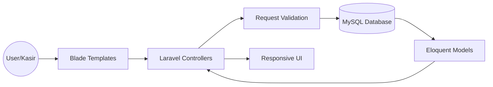

# 🛒 POS Web Application - Sistem Kasir Terintegrasi

Sistem Kasir (Point of Sales) berbasis web yang lengkap dan responsif, dibangun menggunakan **Laravel** untuk membantu manajemen operasional retail secara efisien. Proyek ini mencakup manajemen inventaris, sistem transaksi yang kompleks, hingga pelaporan keuangan otomatis.

## Preview

> 


## 🚀 Fitur Utama

- **Dashboard Informatif**: Statistik penjualan dan stok barang secara real-time.
- **Manajemen Inventaris**: Fitur lengkap CRUD Barang dan Kategori dengan pelacakan stok otomatis.
- **Sistem Transaksi**: Proses penjualan yang cepat, dilengkapi dengan fitur **Diskon** dan cetak struk belanja.
- **Laporan Keuangan**: Generasi otomatis laporan penjualan, laporan keuangan, serta pelacakan **Hutang** dan **Piutang**.
- **Manajemen User & Staff**: Pengaturan hak akses untuk staff kasir dan administrator.
- **Supplier Management**: Kelola data pemasok barang untuk mempermudah restock.

## 🏗️ Arsitektur Sistem

Aplikasi ini dibangun dengan pola arsitektur MVC (Model-View-Controller) yang bersih:



## 🛠️ Tech Stack

* **Backend**: Laravel 11
* **Frontend**: Blade Templates & Tailwind CSS
* **Database**: MySQL
* **Tools**: Vite, Postman, Composer

## 💻 Cara Instalasi (Local Setup)

1. Clone repositori ini:
```bash
git clone [https://github.com/nafisfhkr/web-postkasir.git](https://github.com/nafisfhkr/web-postkasir.git)

```


2. Masuk ke direktori proyek:
```bash
cd web-postkasir

```


3. Instal dependensi PHP:
```bash
composer install

```


4. Instal dependensi Frontend:
```bash
npm install && npm run dev

```


5. Salin file konfigurasi env:
```bash
cp .env.example .env

```


6. Generate kunci aplikasi & migrasi database:
```bash
php artisan key:generate
php artisan migrate --seed

```


7. Jalankan server lokal:
```bash
php artisan serve

```


---

Dibuat dengan  oleh **M Nafis Fakhrudin**

```

